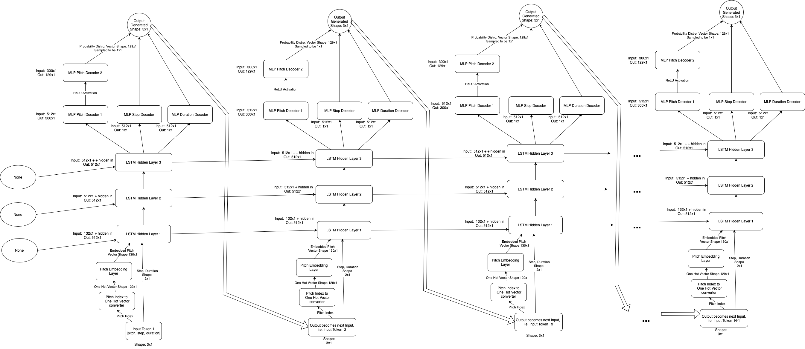
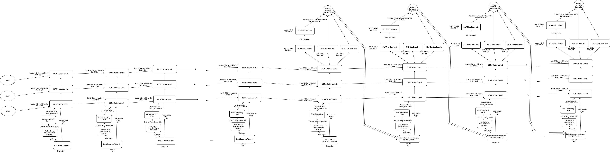
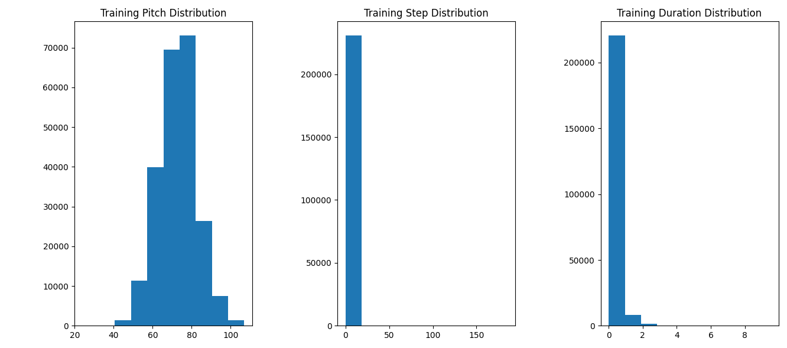
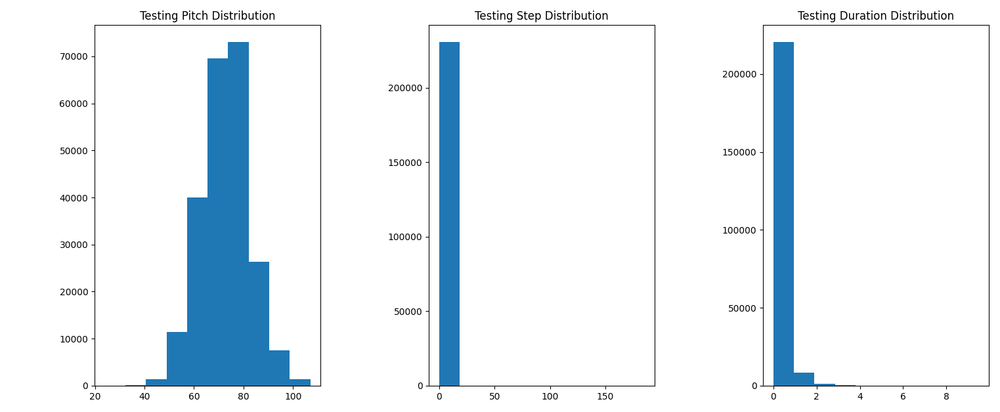

# CSC413 Final Project
## Group Name: Boots and Cats
## Members: 
- **Jackson Joseph Hoogenboom**
- **Chris Botros**
- **Bradley Davis Hebert**

# Introduction
We designed a Deep Neural Network model to create new and original musical compositions. The motivation behind this project is to create a model with real world applications. The need and desire for original musical compositions is everlasting and the use for a music generating model is extremely practical. The ability to quickly generate royalty free music opens new opportunities for companies, advertisers, and creative artists alike. \
Such a task is very ambitious and requires many considerations both developmental and ethical, which we will be explored throughout this report.

# How to run our model
1. Download the data from https://www.kaggle.com/datasets/soumikrakshit/classical-music-midi, run it through our `data_parser.py` functions by doing the below. Make sure to store each of the training, test, and validation sets in a file called `data.pickle` in the root of this directory.
    1. In the root github directory extract the downloaded data into a directory called `data`.
    2. Run the `data_parser.py` script in the command line using the command `python data_parser.py`.
       - **NOTE:** to change where the data parser reads the data from modify the `DATA_DIR` variable in the `data_parser.py` script
    3. After the script runs the `data.pickle` should be created in the root github directory.
2. Once `data.pickle` has been made and stored in the root of this directory, update file paths tagged as `# UPDATE` in the `model_and_training.ipynb` file by following the comments near them in the code. Once this is done, to train the model run please run all the cells up to and including the cell with the `train()` function and the cell towards the bottom of the file with the `sample_sequence()` function definition in it. This cell is the first one under the **Sampling/Producing music** section.
3. Now that everything needed has been run, you may run the cell that trains the model and calls the `train()` function. This cell is below the cell that defines the `train()` function as well as the other functions used by `train()`. If you want to switch up the parameters to train with feel free to look at the doc-string of the `train()` function. The ones currently in this cell are the ones we used to define and train the final model, so the output saved here was our final models output. Note, that though these training statements have accuracy scores as low percents this is a good thing based on how we defined accuracy, see the results section below for more. Alternatively, you can use the provided weights in `report-weights.pk` to preload the model with, you can find the cell to do this below the cell where `train()` is called, in the **Training** section. 
4. Now that the model is trained up or loaded with weights you can head to the **Sampling/Producing music** section and begin creating songs. There is a cell that shows an example call of how to do this below the cell where `sample_sequence()` is defined, please read the doc-string for how to use this function, if you are unsure.
5. Make music doing this for as long as you want, enjoy! At the bottom of this file you will find our functions for computing results under the aptly named **Result Computations** section, you may use these if you would like to compute your models results if you happened to have trained your own model.

**NOTE One: If the instruction order on how to run the cells is confusing they have text cells above them explaining the order to run them in as guidance**

**NOTE Two: the `device` variable is used throughout the code, please ensure this variable has been defined before calling any functions as otherwise they may error.**

# Model
&nbsp; &nbsp; In this section we will analyze how our model functions for its two use cases and explain how it works to generate music sequences in each case. We analyze only the final version of the model we settled on in this report.

## Model Diagram
&nbsp; &nbsp; In this section we will outline the structure of our model for its two use cases, the first use case is generating classical piano music from scratch, the second use case is where the model is first fed a sample sequence of classical midi piano music as a Tensor, in the shape lx3, where `l` is the sequence length and 3 is the dimension of each note in the shape of `[pitch index, step, duration]` where pitch is a integer between 0-127 inclusive and step and duration are continous values for the note. To make a sequence into this shape please see the data section of this file. Using this as inspiration (and to update the models hidden state) the model then generates music, using its built up knowledge of this input as some guidance. Below in the first diagram (Figure 1) is the unrolled diagram of our Recurrent Neural Network Model specifically in the case where it generates music from scratch. In Figure 2 we have our unrolled model for the case of using an input sequence as guidance. To make a model of this shape we create an instance of our models class by calling like so `MusicGenRNN(num_rnn_layers=3)`.  

**Figure 1:** Our Unrolled Generative RNN Model for generating music from scratch.

**Figure 2:** Our Unrolled Generative RNN Model for generating music using an input sequence as guidance.

&nbsp; &nbsp; From Figure 1 and 2, it is seen that our model is made up two key components the encoder layers, and the decoder layers. The encoder component is made up of the following layers: 3 LSTM RNN layers, along with the pitch embedding matrix, and pitch index to one hot vector matrix. On the other side we have the decoder component which is made up of the two MLPs for generating the step and duration of the note respectively, from the last encoder layers output. Also in the decoder component is the two pitch decoder layers with the ReLU activation function between the two used for predicting/generating the distribution of pitches to sample from for the next note, which is later fed in as input.

&nbsp; &nbsp; We will now outline how our model works to generate the musical sequences, this has two possible use cases, we will start with the use case of feeding the model an input sequence as it encompasses the use case of generating from scratch, and we will mention in our discussion when these two differ, and how.

&nbsp; &nbsp; To begin the case where we feed the model an input sequence we do this one token at a time, as seen in Figure 2, we first feed it token/note 1 from input sequence which is a token that consists of the pitch number, which the key we want it to play, as well as the notes step and duration values. To get an input sequence of this style to feed in please see the data section in this readme which will describe the data_parser.py file and its functions. We will also start off by feeding its LSTM hidden states a value of None since this is the first token/note it sees as input. Once this input has propagated through all 3 LSTM layers and the hidden states are updated/computed for this time step (the first time step) we ignore the last LSTM layers output and feed these hidden state values in to the next hidden states as the previous hidden states values for the model along with the next input token/note which is composed of the next values for pitch, step, and duration. We do this to compute the hidden state values for the second time step. We continue this process of feeding in the next token/not from the input sequence and previous hidden states to the model while ignoring the output until we run out of tokens in the input sequence. 

&nbsp; &nbsp; It is at this point where the from scratch generation would start and where we actually start generating output in both use case, these two methods are the same from here on with the following small difference. For the "from scratch use case" we start this generation off by feeding in the hidden states as None valued input like we did at the beginning of the "feeding in input sequence use case". In the "feeding in input sequence use case" however we instead supply the hidden states computed at the end of feeding in the input sequence, as this will contain our encoded memory of the input sequence for which we want to build off of. Moving forward from this, both use cases becomes the same. In both cases once the previous hidden states are fed in, we feed in the begin sequence token and this gets embedded and fed in to the encoding layers so they produce an output to represent the initial note/token distribution. The encoding components output is then fed into the decoder layers. Each decoder layer generates a different portion of the output token/note. There is an MLP decoder layer that generates the step and duration of the note respectively. The other two MLP decoder layers along with a ReLU activation between them generates a categorical distribution for the pitch of the note to be played, this is then sampled from to actually pick the note played. The three components are then combined to produce the output note, this output token/note is then fed back into the model as the next input and we feed in the hidden states we just produced as well to then generated the next token/note in the output sequence. We repeat this for the desired length specified by the user and use the output tokens/notes generated in order to assemble a sequence which we then compose into a midi file using our data parsing tools. This is how our model works.

&nbsp; &nbsp; To perform the above once the model is trained, or loaded with weights head to the **Sampling/Producing music** and look at the code cells there and the docstring to figure out how to interact with the model and make original classical piano music midi files.

## Model Parameter Analysis

&nbsp; &nbsp; Here we analyze the parameters that make up the model. To do this we will go layer by layer. First we have matrix which converts our pitch index into a one hot vector, this is not a trainable parameter but it is part of the model non-the-less. This parameter is an identity matrix of size 129x129 as we have a 128 possible pitches plus our begin sequence token, and each pitch index must be convertible to a one hot vector hence the dimensions chosen. Getting into actually learnable parameters we have our pitch embedding layer (a Linear MLP layer with no bias) it is effectively a matrix that takes the 129x1 one hot vectors in as input and extracts the embedded representation of the pitch which is a continuous vector of size 130x1. Thus this layer gives use 130x129 learnable parameters as it is a fully connected layer. We then concatenate this embedded vector with the continuous step and duration values from the input note/token, giving us a 132x1 input vector into the first LSTM RNN encoding layer.

&nbsp; &nbsp; This layer (the first LSTM RNN encoding layer) gives us 2048x132, 2048x512 and 2048 * 2 parameters. These parameters come from firstly the matrix used to compute the portion of the i_t, f_t, o_t, and g_t vectors used in the LSTM computation as defined in the pytorch LSTM docs which represent the various pieces of the LSTM computation. The input vector of shape 132x1 is used along with other pieces to compute each of these vectors, as such this is where we get the 2048x132 parameter matrix from, as it is multiplied with the input vector as part of the computation of these vectors. The 2048x512 parameter matrix comes from the portion of the computation of the i_t, f_t, o_t, and g_t vectors which uses 512x1 hidden vector as the hidden vector for this layer is multiplied by the 2048x512 parameter matrix. Lastly, the two 2048 parameter vectors come from the bias added to each of these matrix multiplications. We also note that we have 2048xX here as each of the i_t, f_t, o_t, and g_t vectors is 512x1 (since we have a hidden state size of 512 for the LSTM layers) and we compute them by concatenating them on top of each other which gives a 4*512x1 = 2048x1 vector. Which then has the corresponding non-linearity's applied to the corresponding portion of the 2048x1 vector for each vector, this is then used to c_t and h_t a 512x1 vector fed into the next hidden state and used in the next time steps computation. The other two embedding layers give use two 2048x512 parameter matrices and two 2048x1 parameter vectors each. This for similar reasons as the first embedding layer expect we have two 2048x512 parameter matrices instead as the input is now the same size as the hidden since the first encoding LSTM layer outputs a 512x1 vector which is the same size as its hidden state.

&nbsp; &nbsp; Moving on to the Decoder layers these give us the following trainable parameters. Firstly we get two 512x1 parameter matrices and 1x1 parameter vectors from the two fully connected layers that take the final embedding layers 512x1 output vector and compute the step and duration respectively. This gives us a 512x1 parameter matrix and a 1x1 parameter vector for each of these layers as we produce one output each from a 512x1 vector input, and we have a bias. We also get a 512x300 parameter matrix from the first pitch fully connected decoding layer as it takes in 512x1 vector from the last encoding layer and outputs a 300x1 vector to an ReLU activation function which is then passed into the other pitch fully connected layer. We also have a bias in that layer which gives us 300x1 parameter vector. Lastly, the last pitch decoder layer gives use a 129x300 and 129x1 parameter matrix and vector, as it is a fully connected layer with a bias that takes the 300x1 output vector from the previous pitch decoder layer and computes the distribution of the 129 possible pitch values. All of these learnable parameters sum together to give us 130x129 + 2048x132+2048x512+2048+2048 + 2048x512+2048x512+2048+2048 + 2048x512+2048x512+2048+2048 + 300x512+300 + 129x130+129 + 1x512+1 + 1x512+1 = 5714099 many learnable parameters total.

## Model Output Examples

&nbsp; &nbsp; In this section we will analyze a few of the generated classical piano music midi sequences saved as midi files produced by our model. Since we generated music files we unfortunately can not embed them in this readme, so to check them out some examples can be found under the `./Songs` directory. This directory has a `Good-Examples` subdirectory and a `Bad-Examples` subdirectory. Below you can find tables describing the contents of these directories.

**Table 1: Good Examples**
| File Name/Song Title | Description | Notes |
|----------------------|-------------|-------|
| temp8-no-in-med.mid  | A song generated with no given input sequence i.e. made from scratch with temperature about 0.8 and length medium | This was selected as good due to the pleasant sound note choices as well as the varity of durations of notes played making it a good example.
|temp8-test-49-med.mid  | A song generated with input as example 49 from the test set with temperature 0.8 and medium length | This song opens with the test example fed in an then the once it finishes everything the model generated given this input is appended and plays after it, this transition occurs at around 17 seconds. This song was selected as after listening to it as the output sounded pretty good as it did not play the same key repeatedly and made some consistent good note choices. See our Results section for more information on qualities as to why we classed this a good example. 
| temp10-test-98-med.mid | A song generated with input as example 98 from the test set with temperature 1.0 and medium length | This song opens with the test example fed in an then the once it finishes everything the model generated given this input is appended and plays after it, this transition occurs at around 8 seconds. This song was selected as after listening to it the model generated a variety of good sounding notes. Unlike the above the test input pattern though the pattern was not matched as closely, but it was still pretty good. See our Results section for more information on qualities as to why we classed this a good example. 

For more Good examples please see the `"Other good examples"` subdirectory under the `Good-Examples` subdirectory.

**Table 2: Bad Examples**
| File Name/Song Title | Description | Notes |
|----------------------|-------------|-------|
|temp4-no-in-med.mid | A song generated with no input sequence given with temperature 0.4 and medium length/number of tokens required | This song was classed as bad as it plays the same note repeatedly with little variation, we found this to be an issue often when training models and it is especially an issue with most the models we had generate input with temperature < 0.8
|  temp8-no-in-long.mid | A song generated with no input as with temperature 0.8 and long length/number of tokens required | This song opens a seemingly normal sequence but quickly transitions to rapidly playing high pitch notes which we found to be an issue when asking the model for longer sequences/ones with many notes. See our Results section for more information on qualities as to why we classed this a bad example. 
| temp8-test-91-med.mid | A song generated with input as example 91 from the test set with temperature 0.8 and medium length | This song opens with the test example fed in an then the once it finishes everything the model generated given this input is appended and plays after it, this transition occurs at around 7 seconds. This song was selected as bad after listening to it at around 10 seconds it transitions to rapidly playing many high pitch notes all at once very quickly which does not sound vary appealing. See our Results section for more information on qualities as to why we classed this a bad example. 

*NOTE: if you happen to not be able to play midi files on your computer we recommend this website https://midiano.com to upload the files to and play them from there*

# Data
Chris 
- be sure to explain why we used certain data split
- mention the graphs are loss for each batch, not an average.
- show distrbution plots

## Data Source 

The data we used for the project can be found [here](https://www.kaggle.com/datasets/soumikrakshit/classical-music-midi). The data we are using is a collection of classical music in the midi file format. The dataset contains music from 19 famous composers. The dataset was scraped from the website http://www.piano-midi.de.

## Data Parsing & Augmentation
While parsing the data each song is split up into `segments`, each element in a `segment` is a `note` and consists of three attributes:
1. `pitch` - The key that is played as an `int`.
2. `step` - The amount of time that has passed from the previous `note` as a `float`.
3. `duration` - The amount of time the key should be held for as a `float`.

For our dataset we decided on using a segments size `64`. The reason for choosing a size of 64 is that, while experimenting with our model, when using larger segment sizes the model would produce notes with the exact same pitch indefinitely. While using smaller segment sizes would prevent the model from retaining longer term features of how each note effected the next resulting in less cohesive sounding music.

All data parsing, augmentation, and file generation was done using the following helper function defined in the `data_parser.py` file:
- `create_midi_file(fname: str, notes: list[list[int]])` - Creates a new midi file when the name `fname` using the notes provided in the `notes` list
- `parse_music_file(fname: str, split_size: int = 64)` - Parses the midi file with name `fname` into `notes` of segment size `split_size` which are then returned.
- `parse_directory(dir_name: str)` - Parses each midi files in the a given directory into notes of segment size 64 which are then returned.   

## Other Data Augmentation Considerations Made
While working on this project other considerations were made for data augmentation and transformation but after experimentation were found to produce worst results. A primary example of this was our attempts to normalize the `step` and `duration` of the notes and then de-normalize the values generated by the model. Doing this ultimately lead to the model generating almost exclusively long notes that had very large step sizes.

## Train/Validation/Test Data Split

Our dataset is split into `train` (60%), `validation` (20%), and `test` (20%) subsets as this is standard practice when training neural networks. We also split the dataset by song not segment. This is done to ensure no two segments of songs are shared between the three sets which prevents similar segments of notes from the same song form being in multiple sets.

## Statistics 

### Distribution of The Training Set

### Distribution of The Validation Set

### Distribution of The Testing Set

We can see from the above histograms the the training, validation, and testing set have very similar distributions. This shows that our dataset is being split in a way that does not bias different values of notes between sets. Also note that the distributions for step and durations are both skewed to the left this is make senece as it is very common for a note to have there step or duration less than 0 but there are still cases's were the a pitch is played far apart from each other (a larger step) and or held for a long time (a larger duration). 

# Training

## The Training Leaning Curve

## The Validation Leaning Curve

**NOTE:** The above leaning curve graphs are showing loss for each batch, not an average as we found this made it easier to read.

## The Accuracy Graphs

**NOTE:** The above accuracy graphs measures divergence so the lower the numbers imply the accuracy is higher.

## Hyper-parameters Tuning
The hyperparameters we used for this model are:
- `num_epochs=50`
  - The reason we used 50 epochs is because we found that if we went higher the model would start to overfit the training dataset. 
- `batch_size=128`
  - We choose a batch size of 128 since we found that this size Would not only allow the training to run faster but also allowed us to get slightly improved results for our validation loss.

## Limiting The Dataset While Training
While training the dataset we limit the validation and training sets the the first 250 segments. The reason behind this decision is because we found using more then 250 segments resulted in the model generating either notes that were random and seamed not to follow any kind of musical pattered or loop the exact same pitch indefinitely with only the step and duration varying depending on the temperature. But if we used less segments we found that the model would overfit and start producing music that was nearly identical to the training dataset very quickly. 

# Results
&nbsp; &nbsp; In this section we will explain how we quantified our results, what results we obtained, and why we obtained the results we got. To begin we will first explain how we measured our results both quantitatively and qualitatively. To measure our results quantitatively we found this to be challenging as our model was generative, meaning it should produce output it had never seen. Moreover, it was generating music sequences which has multiple unique components. Both of which none of us have had experience with quantifying "goodness" of. That said we ended up deciding on two types of measures.

## How We Measured Results
&nbsp; &nbsp; The first measure we chose was the "loss", the loss is computed as the sum of three different loss components, each computed on parts of the output note those parts being the pitch, step and duration. We calculate a loss on the pitch using logistic cross entropy since this is a categorical prediction the model is making. We calculate a MSE loss on both the step and duration components respectively since these are continuous values it is generating. Now that we know how loss is computed for one token/note, computing the loss on a whole sequence of notes is done in a similar style to teacher forcing where we use the next actual note/token as input compared to the one previously generated by the model, this way we do not let the loss accumulate from mis-predictions since at each time step we enter in the correct token/note as input no matter what, just like in teacher forcing. This is how we compute the loss for one sequence example. To get the loss value for the full set we averaged the loss over all the samples in each set respectively, these results can be seen below. We choose loss as it was pretty simple was to gauged how good our model is a predicting the next note as it measures how incorrect our model was at predicting the next notes given the input notes. The lower this value the better our model would be.

&nbsp; &nbsp; The second measure we choose to gauge the results was an accuracy measure done by comparing the generated distribution of notes with the distributions of notes in the given data sets, we used the following source "Techniques to measure probability distribution similarity" by Renu Khandelwal [1] to build and understand how to compute the similarity of these distributions. The distributions we wanted to compare was that of the generated notes pitch, the distribution of the generated notes step, and the distribution of the generated notes duration with the distribution of each these components of the notes in the both the training and validation set during training, and the testing set once we chose a final model. Our idea here was that in comparing these distributions we can gauge how the generated data matches the real data as if the distributions are similar then the model must be generating notes just as frequently as they occur in the data sets. If the model can do this it must know which notes it should play often and which are rarer so it could play coherent tunes instead of playing random notes. Overall, we figured the more accurate our model would the be the better/closer its produced distribution of notes would follow the distribution in the data set. 

&nbsp; &nbsp; The measure we choose to compare these distributions is the Jensen Shannon Divergence (JSD), we choose to go with this measure of similarity as it is bounded between 0 and 1. The closer the JSD value is to 0 the more similar the distributions are and the closer to 1 the more divergent/less similar they are. To compute the JSDs we generated histograms for each of the pitch, step and duration of notes used these as the probability distributions. To make the histograms for each of the components, i.e. the pitch, step and duration described above, we would have the model generate 50 sample sequences of length 100 and binned each component of the notes into discrete buckets, we similarly binned each component of all the notes in the data sets and then used the JSD to compare these against each other to gauge accuracy. We choose to make the generated distributions from only 50 samples as the distributions are normalized thus we did not need to sample/generate the same amount of data as what is in each data set to get a similar distributution. JSD is built on top of Kullback Leibler Divergence or KL divergence. JSD is the symmetric version of KL divergence meaning the order of the distributions does not make a difference and both are used to measure similarity of the distributions by quantifying the information lost when using one distribution over anther. To see how these are computed please see the functions `_kullback_leibler_divergence()` and `_jensen_shannon_divergence()` in `model_and_training.ipynb` under the training section. These are in the training section as we used them to gauge accuracy during training. The rest of our code to compute results can be found under the **Result Computations** section of `model_and_training.ipynb`.

&nbsp; &nbsp; Since we created a generative music model we also qualitatively gauged the quality of our generated music results. As described in our introduction our task was generating a classical piano sequence/song from midi files trained on famous classical piano composers midi files. So to gauge our quality we listened for various good and bad patterns in the generated music sequences. Good patterns in the generated output sequences include note pattern repetition, as most real songs have some kind of piano riff that would be repeated a few times. Other good patterns included playing two keys simultaneously as this is also often done in real songs. We also listened for bad patterns such as wrong notes/keys getting played, for example playing high notes and then playing one really low note. Other negative patterns listened for was wether it sounded like someone was just hitting as many keys as possible as fast as possible with no structure, or just playing the same key over and over again. None of us were music aficionado so we did not have a lot of experience with judging music so we just used these simple points to look for grading our generation. 

[1] "Techniques to measure probabilty distribution similarity" by Renu Khandelwal https://medium.com/geekculture/techniques-to-measure-probability-distribution-similarity-9145678d68a6

## Our Result Values

In this section we will look at the actual results obtained by our model, both quantitative and qualitative. In Table 3, you will find our Quantitative results measured as described above.

**Table 3** Quantitative results

| Measure Name| Score | Notes |
|-------------|-------|-------|
| Avg. Training set loss | 3.766218465153977 | The close to 0 this is the better. This is the loss value averaged over all examples in the training set
| Avg. Validation set loss | 3.4298499607564668 | The close to 0 this is the better. This is the loss value averaged over all examples in the validation set
| Avg. Testing set loss | 3.5306541454563356 |The close to 0 this is the better. This is the loss value averaged over all examples in the testing set
| Training set pitch accuracy/JSD value | 0.12274975090742343 | This values is bounded between 0 and 1. The closer to 0 the better. Measure of generated pitches distribution similarity to training set pitch distribution.
| Training set step accuracy/JSD value | 0.03802543272082731 | This values is bounded between 0 and 1. The closer to 0 the better. Measure of generated step distribution similarity to training set step distribution.
| Training set duration accuracy/JSD value |  0.03296698056417996 | This values is bounded between 0 and 1. The closer to 0 the better. Measure of generated duration distribution similarity to training set duration distribution.
| Validation set pitch accuracy/JSD value | 0.1352644083608216 |This values is bounded between 0 and 1. The closer to 0 the better. Measure of generated pitches distribution similarity to validation set pitch distribution.
| Validation set step accuracy/JSD value | 0.033256257058337096 |This values is bounded between 0 and 1. The closer to 0 the better. Measure of generated step distribution similarity to validation set step distribution.
| Validation set duration accuracy/JSD value | 0.019707985584919215 |This values is bounded between 0 and 1. The closer to 0 the better. Measure of generated duration distribution similarity to validation set duration distribution.
| Test set pitch accuracy/JSD value | 0.13900275341415294 |This values is bounded between 0 and 1. The closer to 0 the better. Measure of generated pitches distribution similarity to testing set pitch distribution.
| Test set step accuracy/JSD value | 0.04077893880128644 |This values is bounded between 0 and 1. The closer to 0 the better. Measure of generated step distribution similarity to testing set step distribution.
| Test set duration accuracy/JSD value | 0.036794210566783475 | This values is bounded between 0 and 1. The closer to 0 the better. Measure of generated duration distribution similarity to testing set duration distribution.

&nbsp; &nbsp;These quantitative results tell use the following. Firstly, from the "loss" value we can see that the model did not over fit to generating only examples from the training set as the loss values on both the validation and test set are similar to that seen on the training set, infact they are eeven a little lower which is ideal. We know the the model is not benefiting in these other sets from them having sequences from the same song appeear in all three as we made sure to eliminate that possibility in the construction of our data sets, by placing all sequences from one song in one data set, as described in the above data section. We may note though that these loss values may be lower in the validation and testing sets as they are smaller, this may lead to the better losses all though they are averaged as the fewer examples leads to fewer possibiltiess for mistakes and thus lower losses. Over the loss result seen on the test set is pretty good as it is similar to the other two.

&nbsp; &nbsp; The accuracy measures/JSD values are also all pretty good with the pitch JSD being about 0.13 in all of the sets and thee step and duration being about 0.02-0.04 across all of them which is really good. Again these measures show that the model did not over fit to just generating the training sets distribtuion of notes but and actually generate distributions similar to all three sets. That said looking at the plots in thee data section they all have very similar distribtuions of notes to begin with so fitting to one implies fitting well to all. Overall the model does pretty well at generating notes of similar frequency to what wee see in the real data. This tells us the model is not predicting each note uniformly as other wise there would be quite some difference sine we do not see a uniform dirstubiton in the any of the real sets. Moreover, the model is not just generating the most common note as otherwise its distributions would be singular column in all three distribtions which is again would not match the distribtuions of the data sets as we do not see this patter occour with them.

&nbsp; &nbsp; Qualitatively the results found from this model were guaged by generating about 20 or more samples with varying parameters, that is different
temperatures, different lengths, and with different input sequeencees from different sets or not input sequences at all. In the model section you find how to listen to a few of these. Overall the listend to sequences we found the following, we found that when asking for long sequences with or without input and with varying temperature the model tend to produce poor input often leeading to many high pitch notes rapidly played seen with our bad test set example above. We also found when setting the temperature less then 0.8 the model tended to stick to playing just one or two notes repeatedly with the same duration and step. This is likely due to the low temperate cuasing it to repeatedly pick this same note and not try other notes, leading to the same repated prediction. We did also find that model never really cared forward patterns observed input sequences, hwoever it did seemingly make smooth transistions from the input to its own and in some cases tried to repeat the patterns in some capapcity. Moving on towards the positives the model never really tended to play any mis-keys i.e. really low values or high keys randomly when having had been just playing the opposite. We also found the model tended to play notes after each other that sounded proper, i.e. were not starkly different and would even go up and down the scales a little bit in some examples. Lastly, if requested medium length sequences ones that were longer then the samples it was trained on but not too long it could produce nice sounding sequences of that length. Overall, we believe the model produced pretty reasonable sounding outputs.

## Results Discussion

&nbsp; &nbsp; After having trained many many models and listened to their outputs and observed their quantitative result scores, we believe the model we settled on performed reasonably given the task at hand and as good as we could achieve given the difficulty of the problem, that said it could still be better. In coming up with this final model we tried many different approaches and had many different results. The general model we followed stayed roughly the same however some approaches differed more then others. Our general inspiration for the model came from the text generation example in class where given a character the model would generate the next character by encoding it in an RNN and then using the encoding and passing it thorugh a linear layer to decode it and generatee a distribtuion to sample the next character from. In our case it was a littlee more complex but we followed a similar pattern instead we passed in a note represented as pitch, step, and duration, encoded it with a LSTM RNN for being able to handle longer term dependences. After this since we had three pieces to generate insteead of just a character one of these pieces was the pitch which was rather similar to the text example inclass so we used a decoder of a linear layer to tunr the encoded output into a categroical distribution for the pitch to smapled from. The other two pieces we had to generate for a note is the step and duration these were continous values so insteead of generating a distribution we used linear layers to turn the encodeed information into these continous values. Overall this is why used the general approach we did. Here we will explain the alternative models and approaches and why we settled with the one we did. One approach we tried was only having one LSTM encoding layer we found that this could only make relatively good songs for really small sets of the data this was likely due to the limited capacity the model had to encode information as one layer does not allow for it to understand the quite complex distributions of the underlying data. Another approach we had tried was using just one decoding layer for the pitch this seemed to work well however with more data to train on and step and duration decoder layers also competing for infomation in the encoded layer to help generate these peices we found one layer was not enough and the pitches generated could not form any complex patterns so we added a second with nonlinearty between them to enable the pitch decoding to have more capacity for turning the encoded information into a proper pitch. We also tried having one approach of running the training loss close to 0 we found this caused thee validation loss to shoot up quite a bit, and we had two different cases happen. The first casee we had was when madee the model havee many encoding layers and high width with all the data possible in the train set (described  more below) the model overfit to the data so much that it was reproducing entire songs verbatim which is not what we wanted, when we did not do this as described earlier the mdoel with all this data would either play the smae note or just noise/random notes. The other case we had was with a less complex model and fewer data samples (smaller then what we settled with even), in this casee the model actually performed quite well with interesting riffs and complex patterns things our current model could not do without reproducing training data verbatim, however it couldn't make sequences longer then what was in the training set and the validation results we poor, even when generating music off the validation smaples it did not really maintain the musical pattern, however he did like these results so it was hard choice between this version and the one we went with. We went the model described in the model section though as it generated ok music in both triaing and validation sets and its loss value as seen above was about even on both sets. Moreover the model above was ablee to handle obersving more of the training set without causing issues exaplined in the above sections. Another approach we had also tried making the embedding layers very wide, and making way more this was able to handle more data but must haveben overfit to the training set or it would just make noise i.e. rnadom notes played this is issue of using more data is described more in the training and data sections. Finally an approch we tried was making mulitple encoders each with their own decoder layers to generate the pitch step and duration independently, we did this as that way the loss computations would not all go backwards over the same encoder LSTM layers potenetially causing issues and conflicting optimizations. This idea seemed like it would work well as it independently when training models for the purpose of overfitting or experimentation witht he design when the model was just producing pitch and holding step and duration constant or just producing step or just producing duration it worked really well, making complex patterns and elegant sounds, something that was really close to real music. We figugred merging thse models together by having seperate encoding, and decoding layeers for each piecee would work well but it ended up not performing as expected. In doing this the relationships beetween the three were lost as each piece was working independetly though they all got fed in the same total note. It ended up producing random notes of different durations and steps with not pattern or rythm. 

&nbsp; &nbsp; Overall the model we ended up with described in the model section we found performed pretty good overall had good accuracy scores and loss values on allt the sets and did not procduce just noise or play the same note over and over all the time. Going forward the modeel could definitly be improved as it does not generate complex pattersn of notes where many are played at once in a pleasant sounding way, most if not all thee smaples produced stick to the same region of the keyboard and are most of the time one note at time, so this is an area that could definilty be improved. Another spot for improvement would be being able to handle oberving pattersn in all the training data this would allow it to learn more patterns. We believe our model lacked in these two areas likely due to the loss functions competing for optimizing the encoding layers with respect to each decoder. This is believed as when we had held pieces of notes constant and let the model just work to generate the none fixed piece i.e. pitch it performed quite well, so we think that when doing descent with respect to the different losses it was making it tricky for the encoder balance how it encoded to be able generate each piece of the note. This tells us that approach probably doesnt work well for the complex multi element character langauge that is music. The reason we believe the model may have struggled with handling lots of data to train off of is likely similar to the above reasonsing with loss coupled with the too few paramters and not having enough complexity to represent the underlying distributions to be able generate the data from. However the size of model likely need to do something like this is infeasible for us to train with out limited resources. 

&nbsp; &nbsp; Going forward alternate approachs and things we could try to make a better performing wis the following. We believe the model could possible be improved by switch to a GAN style where we have a discrimantor work to determine wether smaples genertated or not by the generator which could be an LSTM rnn model, this could work better to opitmize the generator as we believe the issues in our model may have come from how we computed the loss so if we had more time we could have used a discrimintor for this and seen how this perfromed. Another option we could havee tried is using Attention as music patterns and notes only really rely on portions of previous notes at a time, for exmaple repeating the chorus would only rely on the prior seen chorus. We could also try adding attnetion into our model moving forward to be able to reproduce this behavior. Moreover it could help us handle even longer sequences better so wee could make longer songs as the internal states would not have to worry about gradient explosion or vanishing over the longer term dependencies. Overasll this is why we choose the final model chose and what we had tried and could try going forward given our reuslts.

# Ethical Considerations
There are several ethical considerations to consider in a model that generates original music... \
The first of such considerations is what can we constitute as "new" music. What separates the music generated by our model, or a similar model from the music it's trained on or the other music in the style of the artists in the dataset? Such a generalization can be very individualistic. For example, a musical artist may consider the generated music to be plagiaristic, considering the model as taking from its dataset. They may not believe that the generalization of the model is not sufficient to consider it as "inspiration" like a human would when writing their own music. However, a machine learning engineer may consider it the other way. They may personally consider the generalization of a large music generation model to be sufficient enough to consider it as being "inspired" by its training set. We saw how this could be a problem in the development of our model. When the model began to overfit, it would almost identically clone a song or part of a song from its training set. Often we had to use a tool like Shazam to see if our generated song matched an already existing song in the dataset. So how can we determine when a model is trained sufficiently that it's not plagiarizing a song from it's dataset, or how much of it is generalized? Ethically it's hard to say, and who's opinion is "better" or more valid? We see this now in the media as people exist on both sides of the spectrum on whether these generative models are plagiaristic or not \
Another ethical consideration is that the model can negatively effect individuals that rely on a career in creating music. Suppose an advertising agent that outsources music to freelance music artists no longer needs to use such artists as they can now use an open source music generation model to generate music for their ads. Now, the company saves money, but the artists are receiving less work now. This can extend to fully contracted artists, will they lose their job? Will the need for commercial musical artists go away with the introduction of music generating models into the main stream? This is an ethical consideration that is extremely important as it directly impacts the livelihood of any people in society.   

# Authors

| Task | Members | What was completed |
|------|---------|--------------------|
| Project discussion and proposal rough draft | All  | All members got together. The project idea was formulated, researched, and the data required was found. The tasks for each member to work on the proposal was decided
| Finish and submit Proposal | All | All members got together via zoom to finish the project proposal and submit it on markus
| Repository Setup | Chris | The repository was created and setup on Github. Other members were added
| Code and model setup | All | All members got together and began to develop the model. This was done on through pair programming on google colab
| Write data parser | Chris | Write data parser for parsing dataset to something computable by the model
| First training session of the model | All  | We all got together and coded up the first model and training and sampling functions. The results were quite noisy and on our first attempt to overfit we could get the loss down but could not get the model to overfit properly and produce one sample. We had also trained on all the data and had gotten the model to make noisy results, so we were going to further investigate our model and results
| Tweaking and testing for errors in model | Jackson | tried various things with out model, realized there was an error in computing loss, and this is why we could not overfit a sample. Fixed the issue so the model could overfit perfectly on sample. Experimented with a few other model designs, found one that worked well on a little portion of data
| Further Training and Experimenting | Brad | Worked on training the model on a slew of various hyperparameters and model configurations. Including aspects like number of layers, batch size, training size, and number of epochs. Analyzing causes of overfitting and and underfitting
| Data experimenting | Chris | Experimented on how using different segment sizes, data splits, and data transformations affected the results of the trained model. 
| Deciding upon a final model and more train | All | Finalizing the model, deciding which hyperparameters worked best. Training the model and recording output graphs, performance, loss, and the music it was able to generate. Also, the dividing up of the final report so we could all start individually 
| Training and analyzing experimental model | Brad | Developed and trained a different model than our decided upon one to see if a different, but similar, approach would improve the model. Analyzed performance of this extra model to our chosen one and found our chosen one performed better in general
| Report write up | All (individual) | Jackson worked on the Results and model section, cleaned the code and added docstrings. Brad wrote the introduction and ethical sections, Chris wrote training and data sections
| Report revision | All | Everyone worked together to review and edit the readme made sure everything was working order with the code, and submitted

