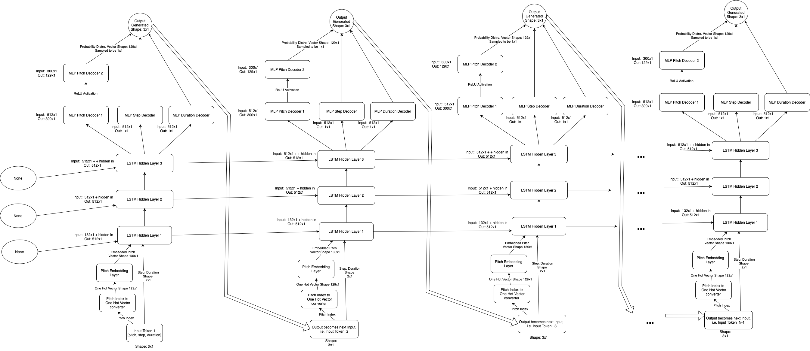
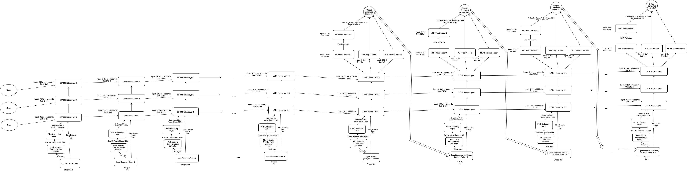

# CSC413 Final Project
## Group Name: Boots and Cats
## Members: 
- **Jackson Joseph Hoogenboom**
- **Chris Bostros**
- **Brad Hebert**

# Introduction
Brad

# How to run our model
1. Download the data from https://www.kaggle.com/datasets/soumikrakshit/classical-music-midi, run it through our `data_parser.py` functions by doing the following, to store each of the training, test, and validation sets in a file called `data.pickle` in the root of this directory.

    1. Sub steps here***
    2. more steps
2. Once `data.pickle` in the root of this directory, update file paths tagged as `#UPDATE` in the `model_and_training.ipynb` files. Once done to train the model run please run all the cells up to and including the cell with the `training function` as well as the cell towards thee bottom with the `smaple function` deefintion in it under the **Generate music** section before calling `train()`.
3. Now that everything needed has been run you may run the cell that trains the model. this cell is below the cell that defines `train()` and the functions `train()` uses. If you want to switch up the parameters trained with feel free to look at the docstring of the `train()` function. Alternatively, you can use the proivded wieghts in `report-weights.pk` to preload the model with, you can find the cell to do this below the cell where `train()` is called, in the **training section**. 
4. Now that the model is trained up you can head to the **Sample music** section and begin creating songs there is a cell that will do this beelow the cell where `sample()` is deefined, please read thee docsting for how to use this function.
5. Make music doing this for as long as you, enjoy! At the bottom of this file you will find our functions for computing results, you may use these if you would like to compute your models results if you train your own.

*NOTE IF the instruction order on how to run the ceells is confusing they have text cells above them explaining the order to run theem in*

# Model
&nbsp; In this section we will analyze how our model functions for its two use cases and explain how it works to generate music sequences in each case.

## Model Diagram
&nbsp; In this section we will outline the structure of our model for its two use cases, the first use case is generating classical music from scratch, the second use case is where the model is first fed a sample of data and then generates music from using its built up knowledge of this input as some guidance. Below in the first diagram (Figure 1) is the unrolled diagram of our Recurrent Neural Network Model specifically in the case where it generates music from scratch. In the Figure 2 we have our unrolled model for the case of using an input sequence as guidance. 

**Figure 1:** Our Unrolled Generative RNN Model for generating music from scratch.

**Figure 2:** Our Unrolled Generative RNN Model for generating music using an input sequence as guidance.

&nbsp; From Figure 1 and 2, it is seen that our model is made up two key components the encoder layers, and the decoder layers. The encoder component is made up of the following layers 3 LSTM RNN layers, along with the pitch embedding matrix, and pitch index to one hot vector matrix. On the other side we have the decoder component is made up of the two MLPs for predicting the step and duration of the note from the last encoder layers output, as well as the two pitch decoder layers with the ReLU activation function between the two used for predicting/generating the distribution of notes/pitches to sample from for the next note, which is later fed in as input.

&nbsp; We will now outline how our model functions work to generate the musical sequences, this has two possible use cases, we will start with the use case of feeding the model an input sequence as it encompasses the use case of generating from scratch, and we will mention in our discussion when these two differ.

&nbsp; To begin the case where we feed the model an input sequence we do this one token at a time, as seen in Figure 2, we first feed it Token 1 which is token that consists of the pitch number, which the note we want it to play, as well as the notes step and duration values. We will aso start off by feeding its LSTM hidden states of None since this is the first Token it sees. Once this is input has propogated through all 3 LSTM layers and the hidden states are updated/computed for this time step (the first one) we ignore the last LSTM layers output and feed these hidden state values in as the previous hidden states values into the model along with the next input token made with the next values of same components pitch, step, and duration. We do this to compute the hidden state values for the second time step. We continue this process of feeding in the next token and previous hidden states until we run out of tokens in the input sequence. 

&nbsp; It is at this point where the from scratch prediction would start and where we actually start generating output in the input feed in sequence use case, thes two methods are the same from here on out with the following small difference. The from scratch use case we start this generation portion of functionality off by feeding in the hidden states as None input like we did at the begining of the feeding input sequence use case. In the feeding in input sequence usee case however we instead feed in the hidden states computed at the eend of feeding in the input sequeence as this will contain our encoded memory of the input sequence for which we want to build off of. Moving forward from this, both use casees becomes the same. In both cases once the privious hidden states are fed in we feeed in the beegin seequence token and thhis gets embeded and fed in to the encoding layers so they produce an out to represent the initial note/token distribution. The encoding compoents output is then fed into the decoder layers. Each decoder layer predicts a different potion of the output token two of the MLP decoder layers predict the step and duration of note respectively. The other two layers with a ReLU activation between them generates a dirtubtion from for the pitch/note to be played, this is then smapled from to actually pick the note played. The three compontents are then combined to produce the output, this output token is then fed back into the model as the next input and we feed in the hidden states we just produced as well to then generated the nextoken in the sequence. We repeat this for the desired length specifided by the user and use the output tokens generated to assmeble a sequence which we then compose into a midi file using our data parsing tools. This is how our model works.

## Model Parameter Analysis

&nbsp; Here we analyze the parameters that make up the model. To do this we will go layer by layer. First we have matrix which converts our pitch index into a one hot vector, this is not really a trainable paramter but it is part of the model non the less, and is an identity matrix of size 129x129 as we have a 128 possible notes plus our begin sequence token, and each has a pitch index must convetable to a one hot. Getting into actually learnable parameters we have our pitch embbedding layer (a MLP layer with no bias) it is effectivley a matrix that takes the 129x1 onee hot in a input and extracts the embbedded representation of the pitch which is a continus vector of size 130x1 so this layer gives use 130x129 learnable parameters as it if a fully connected layer. We then concatene this embdeed vecotr with the continous steep and duration from the input on to the end, giving us a 132x1 input vector into the first LSTM RNN encoding layer. This layer gives us 2048x132, 2048x512 plus 2048 * 2 parameters. These parameters come from firstly the matrix used to compute the portion of the i_t, f_t, o_t, anf g_t vectors used in the LSTM computation from the input 132x1 vector, which is where we  get the 2048x132 paramter matrix from. These 2048x512 parameter matrix also come from the computation of the portion of the  i_t, f_t, o_t, anf g_t vectors which come from the 512x1 hidden vector, and lastly the two 2048 parameter vectors come from the bias added to each of these matrix multipliactions. We also note that we have 2048xX here as i_t, f_t, o_t, anf g_t vectors as each is 512x1 (since we have a hidden state size of 512 in these layers) and we compute them by concatenating them ontopof each other which gives a 4*512x1 = 2048x1 vector. The other two embedding layers give use two 2048x512 and two 2048x1 each. This for similar reasons as the firs embedding layer expcet we have two 2048x512 paramter matrices instead as the input is now the same sizee as the hidden since the first encoding LSTM layer outputs a 512x1 veector. Moving on to the Decoder layers these give us the following trainable paramters. Firstly we get two 512x1 and 1x1 parameters from the two fully connected layers that take tehe finaly embdding layers 512x1 output and compute the step and duration respectively. We also get a 512x300 and 300x1 from the first pitch fully connected decoding layer as it takes in 512x1 vector from the last encoding layer and outputs a 300x1 vector to an ReLU activation function passed into the other pitch fully conneected layer. We also have a bias in that layer which explains  a 300x1 vector. Laslty the last pitch decoder layer gives use a 129x300 and 129x1 paramter matrix and vector, as it is a fully connected layer with a bias that takes the 300x1 output vector form the previouc pitch decoder layer and computes the distribtion of the 129 posisble pitch values. All of these learnable paramters sum together to give us 120x129 + 2048x132+2048x512+2048+2048 + 2048x512+2048x512+2048+2048 + 2048x512+2048x512+2048+2048 + 300x512+300 + 129x130+129 + 1x512+1 + 1x512+1 = 5712809

## Model Output Examples

# Data
Chris 
- be sure to explain why we used certain data split
- mention the graphs are loss for each batch, not an average.

# Training
chris

# Results
&nbsp; In this section we will explain how we quantified our results, what results we obtained, and why we obtained the results we got. To begin we will first explain how we measured our results both quantitatively and qualitatively. To measure our results quantitavitvely we found this challenging as we were our model was generative meaning it should produce output it had never, and none of us were really fimilar with how to quantitaively measure this. We ended up deciding on two types of measures.

## How we Measured Results
&nbsp; Firstly the "loss", the loss is computed as the sum of three different loss components computed on each part of the output token. We calcualte a loss on the pitch using logistic cross entory since this is a categorical prediction the model is making and we calculate a MSE loss on both the step and duration components respectivley. We compute the loss in a similar style to teacher forcing where the we use the next actual token compared to the one generated for that time step by the model, moreover we don't let the loss accumulate from mispredictions since at each time step we enter in the correct token as input no matter what, just like in teacher forcing. To get the full loss value we averaged the loss over all the samples in each set respectively these results can be seen below.

&nbsp; The second measure we choose to gauge results was an accuacy measure comparing the genearted distrubtion of notes with the distributions in the given data sets, we used the follwong source "Techniques to measure probabilty distribution similarity" by Renu Khandelwal to build a understand of how to compute the similarity of distributions [1]. Our idea here was to compare the distribution of generated notes pitch, the distribution of generated notes step, and the distribution of generated notes duration with the distubtion of each these compontents of the notees in the both the training and validation set during training, and the testing set once we chose a model to go with. We chose to do this as we figured the more accurate our model would the be the better/closer its produced distribtioon of notes would follow the distribtuion in the data set. The measure we choose to compare these distribtuins is the Jensen Shannon Divergence(JSD), we choose to go with this measure of similarity as it is bounded between 0 and 1. The closer the JSD value is to 0 the more similar the distribtuions are and the the closer to 1 the more divergent they are. To compute these values we genertated histograms as used these as the probability distribtuions. We made histograms for each of the components, i.e. the pitch, step and duration deescribed above and built them by using 50 smaples generated from the model of length X and used JSD to compare these against the histograms made on each set of the data. We only went with 50 samples as the distribtuions are normalized thus we dont need to sample/generate the same amount of data as what is in each set to get an accurate distribtuion. JSD is built on top of Kullback–Leibler Divergence or KL divergence. JSD is thee symetric version of KL divergence and is used to measure similarity of the distribtuions by quantifing the information lost when using one distribtuion over anther. to see how it is computed pleease see the functions `_kullback_leiber_divergence()` and `janseen_divergence()` in `model_and_training.ipynb` under the training section, they are in this section as we used them to gaugee accuaracy during training. The rest of our code to compute results can be found under the results section.

&nbsp; Since we were made a generative music model we also qualittavivleey gauged the qualitity of our generated music. As deescribed in our introducation our task was generating a piano track from a midi file trained on fmaous classical composers midi files. So to gauge our quality we listened for various good and bad patterns good patterns includeed, pattern repition in notes, as most songs have some kind of piano riff that would be repeated a few times. We also listened for bad patterns suchs as wrong notes or keys getting played, for example playing high notes and then playing one really low note. Other negaitive patterns listened for was wether it soundeed like someone was just hitting as many keys as possible as fast as possible with no structure, and also just playing the smae key over and over again. None of us were music effeciandos so we did not have alot of experience with judging musics so we just used these simple points to look for grading our generation. 

[1] "Techniques to measure probabilty distribution similarity" by Renu Khandelwal https://medium.com/geekculture/techniques-to-measure-probability-distribution-similarity-9145678d68a6

## Our Result Values

## Results Discussion

# Ethical Considerations
Brad

# Authors
-  Jackson J. Hoogenboom (hoogenb2) 
-  Bradley D. Hebert (hebertbr)
-  Chris Botros (botrosc2)